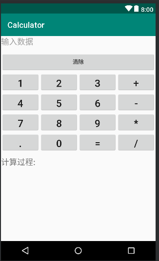

# 基于Android的简易计算器

## 设计目的
- 能对用户所输入的数据进行简单的加减乘除的运算
## 适配手机类型
- Android 4.0以上的手机均可以进行安装
## 软件安装使用流程
1. 下载该文件并打开Android studio
2. 依次打开File>open>选择软件所在地址目录，将软件导入
3. 点击run按钮并选择所要安装的目标设备即可将软件安装
## 软件特点
1. 具有较为简单舒适的UI界面，便于与用户交流

2. 本软件不能进行连加等功能，即只能进行“number1+（+、-、*、/）+number2”类型的计算
## 软件的重要组成部分
- layout文件夹下的xml布局文件
  
-   Java文件夹中的MainActivity

## 软件测试结果
- 加法计算

- 减法计算

- 乘法计算

- 除法计算

## 注意事项
- 每次计算完成后必须点击“清除”才能进行新的计算
- 该软件不能进行纯负数的计算

